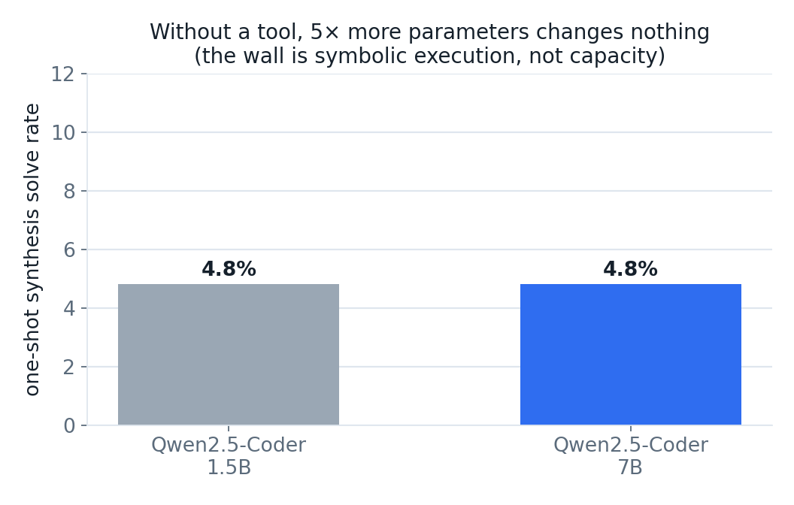
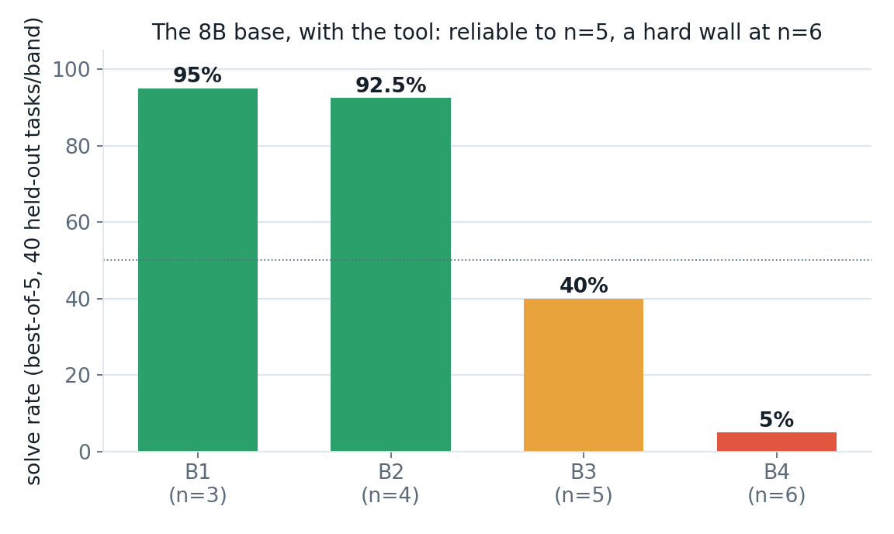
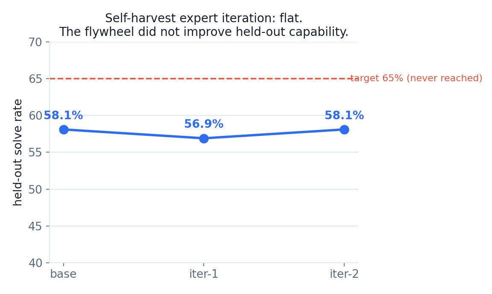
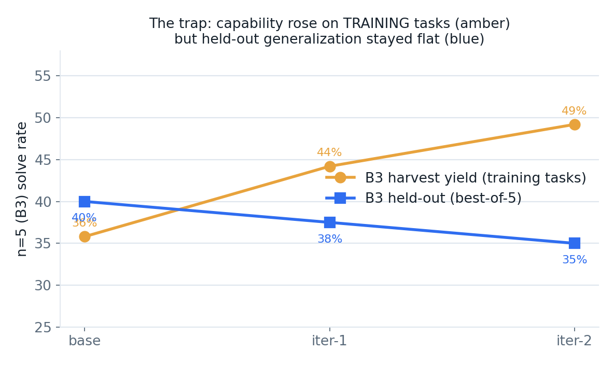

# Verifier-Backed Tool Use and the Limits of Self-Harvest Expert Iteration in Small-Model Reversible-Circuit Synthesis

> **In plain language**
>
> We tried to teach a small AI two things: (1) to design a particular kind of reversible computer circuit — the sort quantum algorithms are built from — and (2) to *teach itself* to get better by practicing on problems it can check its own answers to.
>
> - **The self-teaching idea did not work.** After two rounds of practicing on its own correct answers, the AI was no better on fresh problems than when it started (about 58% solved, both before and after). Training a model on answers it can already produce mostly teaches it what it already knows.
> - **One thing worked well, and it wasn't size.** Without a "scratchpad" tool, a small model and a model five times larger were *equally bad* (both ~5%) — the hard part isn't knowledge, it's keeping track of the work in your head. Give the AI a scratchpad that shows what's still wrong after each step, and it starts solving real problems; only *then* does a bigger model pull ahead.
> - **Bottom line:** the model is genuinely useful on the easier cases, the self-improvement idea hit a real wall, and we're publishing the honest result — including the parts that didn't pan out. The model and the full write-up are free and open (links below).

> **TL;DR (technical)**
> - On one-shot reversible-circuit synthesis without a tool, a 1.5B and a 7B model of the same family achieve an identical 4.8% solve rate; the limiting factor is symbolic execution of the running circuit, not model capacity.
> - A state-externalizing tool that renders the residual after each gate removes this bottleneck, and only with the tool does scale appear to become decisive: a trained 1.5B (Qwen2.5-Coder-1.5B) caps at register width n=4, whereas a trained 8B (Qwen3-8B) reaches n=5. Because the two tool-trained models are of different families and generations, this single comparison confounds scale with family and is suggestive rather than a controlled ablation.
> - Self-harvest expert iteration — supervised fine-tuning on the model's own verifier-confirmed solutions — produces no detectable held-out improvement: base, iter-1, and iter-2 differ by at most 1.2 points overall (58.1 / 56.9 / 58.1% at best-of-5), within per-band sampling error at n=40.
> - Capability gains observed on the training distribution (harvest B3 yield rising from roughly 36% to 44% over two harvest rounds) do not transfer to held-out tasks (held-out B3 flat at 40 / 37.5 / 35%), isolating a harvest-versus-generalization gap.

## Abstract

This report studies whether a small open-weight language model can learn tool-driven synthesis of reversible (classical-reversible / quantum) circuits, and whether it can improve at the task through expert iteration on its own verifier-confirmed solutions. As a cheap and faithfully gradeable stand-in for the [ECDSA.fail](https://ecdsa.fail) secp256k1 point-addition challenge, the task is GF(2) linear-map synthesis: emit a sequence of reversible gates that transforms the identity into a target invertible n×n GF(2) matrix in place. Correctness is decided by a bit-packed classical-reversible simulator that agreed with a Rust reference on all 800 cases of the equivalence battery used, spanning the gate families and register widths exercised by the proxy. Three findings are reported. First, in the one-shot setting the task is insensitive to model scale: a 1.5B and a 7B model of the same family synthesize correctly at an identical 4.8%, locating the bottleneck in symbolic execution rather than capacity. Second, a state-externalizing tool removes this bottleneck, and only then does scale appear to matter: a trained 1.5B caps at n=4 while a trained 8B reaches n=5, on a single cross-family comparison that should be read as suggestive. Third, and centrally, self-harvest expert iteration yields no held-out improvement; across two iterations the overall best-of-5 solve rate is flat at approximately 58%, and the result is explained mechanistically. All comparisons use a fixed held-out set of 40 tasks per band under a best-of-5 protocol.

---

## 1. Introduction

The [ECDSA.fail](https://ecdsa.fail) challenge asks for a reversible circuit that computes secp256k1 elliptic-curve point addition at minimal cost, where cost is the executed Toffoli count multiplied by the peak qubit count. This is an open combinatorial-optimization problem: no efficient classical procedure is known to yield the optimum, and each candidate circuit is expensive to evaluate. The question motivating this work is whether a small, open language model can acquire reversible-circuit synthesis as a transferable skill, and whether such a model can bootstrap its own improvement on the task.

Direct training on the 256-bit frontier is infeasible. Each evaluation requires seconds of reference simulation and the search space is astronomical, so neither large-scale harvesting nor adequately-sampled evaluation is affordable at that width. To make the question tractable, the study uses a **proxy task** chosen to preserve the structure of the target problem — reversible-gate synthesis against a hard target, scored by an exact verifier — while remaining cheap enough to iterate on and to evaluate with sufficient samples. The proxy is the synthesis of reversible circuits for random invertible GF(2) linear maps, graded by register width.

The GF(2)-linear family is classically solvable by Gaussian elimination, which serves as a source of provably optimal expert demonstrations. The objective is therefore not to outperform Gaussian elimination but to test (i) whether a small model can learn tool-driven synthesis at all, and (ii) whether expert iteration on self-generated, verifier-confirmed solutions can extend the model's reach — a method that would, in principle, transfer to problems for which no closed-form expert exists.

The contributions of this report are:

1. A diagnosis that one-shot reversible-circuit synthesis is bottlenecked by symbolic execution rather than model capacity, evidenced by an identical 4.8% solve rate at 1.5B and 7B parameters within a single model family (§3).
2. Evidence that a state-externalizing, verifier-backed tool removes this bottleneck and renders the task scale-sensitive, with a trained 1.5B capped at n=4 and a trained 8B reaching n=5; this rests on a single cross-family comparison and is reported as suggestive rather than as a controlled scale ablation (§3).
3. A clean negative result: self-harvest expert iteration produces no held-out improvement over two iterations, with a mechanistic explanation (§5, §7).

---

## 2. Task and evaluation setup

### 2.1 The gf2_linear proxy

The synthesis family studied is `gf2_linear`. An instance is a uniformly sampled invertible n×n matrix over GF(2). A solution is a sequence of reversible gates — controlled-NOT (`CX`), Toffoli (`CCX`), and `SWAP` — that, applied in place to an n-bit register initialized to the identity transformation, realizes multiplication by the target matrix. The model emits gates; the environment maintains the running transformation and compares it against the target.

Difficulty is parameterized by register width n and partitioned into four bands:

| Band | Register width n |
|------|------------------|
| B1 | 3 |
| B2 | 4 |
| B3 | 5 |
| B4 | 6 |

The small-width bands saturate quickly: there are only 168 invertible 3×3 matrices over GF(2), so an expert demonstration set nearly exhausts B1 and B2. Genuinely novel coverage is available only at n≥5; the n=5 instance space comprises on the order of 10^7 matrices.

### 2.2 The verifier and its equivalence battery

Correctness is decided by a bit-packed classical-reversible simulator (`proxy/proxy_env.py`). To establish that the simulator is an exact arbiter rather than a learned approximation of correctness, it was checked against a Rust reference simulator on an 800-case equivalence battery (`proxy/test_equivalence.py`): 400 basic cases and 400 broad cases spanning the gate families and register widths exercised by the proxy. The simulator agreed with the reference on **800 of 800** cases. Within this battery, a circuit accepted by the simulator is correct in the same sense that the reference would accept it. This is an empirical agreement over the families and widths actually used; it is not a general proof of bit-identity across all inputs.

### 2.3 Expert demonstrations

Optimal expert demonstrations are produced by Gaussian elimination (`proxy/synth.py`), which yields a canonical, minimal-style gate sequence for any invertible target. These demonstrations supply both the imitation-learning corpus for the base model and the ground-truth reference for the difficulty grading.

### 2.4 Evaluation protocol

All held-out evaluations use a fixed set of **40 tasks per band**, with seeds held constant across the base model and every iteration so that every checkpoint is scored on the identical instances under an identical protocol. Each checkpoint is evaluated under **best-of-k** sampling: the model is given k independent attempts per task and the task counts as solved if the verifier accepts any attempt, in the manner of a verifier selecting the best of several candidate circuits. All comparisons use best-of-5 at temperature 0.7, which matches the five restarts per task used during harvesting (§4); at the low solve rates of the harder bands a 40-task sample requires this budget to resolve band-level differences. (A best-of-2 run at temperature 0.4 is also recorded in the released data for completeness.)

---

## 3. Tool use and the role of scale

### 3.1 The one-shot wall: 1.5B = 7B = 4.8%

In the one-shot setting the model emits an entire gate sequence in a single generation, which the verifier then accepts or rejects. Two models of substantially different scale but the same family were measured on held-out tasks:

| Model | One-shot synthesis (held-out) |
|-------|-------------------------------|
| Qwen2.5-Coder-1.5B | 4.8% |
| Qwen2.5-Coder-7B | 4.8% |

The two solve rates are identical. A roughly fivefold increase in parameters within one model family produces no change in performance, which is the signature of a bottleneck that scale does not address. The limiting skill is symbolic execution: the model cannot maintain the running circuit state across a growing gate sequence, and therefore cannot determine whether a partial sequence is on track. It synthesizes without feedback.



The diagnostic implication is that the appropriate intervention is not a larger model but a mechanism that relieves the model of internal state-tracking.

### 3.2 The tool: externalizing circuit state

The intervention is a stateful environment, `ToolEnv` (`proxy/tooluse.py`), that the model drives one gate per turn. After each gate the environment re-renders the current transformation against the target. For `gf2_linear` it displays the residual rows, for example:

```
current y0 = x0 | target y0 = x0^x2^x4   <-- WRONG
```

The model no longer simulates the circuit internally; it reacts to an externalized, always-correct view of the remaining discrepancy, in the manner of a human performing row reduction against a visible tableau.

Two properties of this setting shape the rest of the study. First, untrained zero-shot tool use does not succeed: untrained models emit malformed operations, reverse their own progress, and loop. Access to the state is necessary but not sufficient — the model must be trained to act on it. The bottleneck thus moves from state-tracking to sequential planning. Second, the residual render is **Markov**: the current residual fully specifies the remaining problem, independent of how it was reached, a property used in the harvesting design (§4).

Tool-driven training data is produced by a trace factory (`proxy/tooltrace_gen.py`) that records expert turn-by-turn play, one canonical operation per turn, framed identically to the evaluation interface so that the training and evaluation distributions coincide. Including the target truth table in the prompt is necessary to fully specify each instance; doing so raised the count of distinct tasks to 31,718.

### 3.3 With the tool, scale matters

Models trained on tool-driven traces and evaluated while driving the tool on held-out tasks exhibit a scale dependence absent in the one-shot setting:

| Model (trained, tool-driven) | Top solvable band |
|------------------------------|-------------------|
| Qwen2.5-Coder-1.5B | B2 (n=4); remains at 0% on B3 even when trained directly on B3 |
| Qwen3-8B | B3 (n=5); materially above zero |

The 1.5B's failure at n=5 is a capacity ceiling rather than a data limitation: it stays at 0% on B3 even when trained on B3 instances. The two models that were indistinguishable without the tool are a full band apart with it. The tool converts a capacity-insensitive task into a capacity-sensitive one.

This comparison should be read with care. The tool-trained 1.5B is `Qwen2.5-Coder-1.5B-Instruct` and the tool-trained 8B is `Qwen3-8B` — a different model family **and** a different generation, not two sizes of one architecture. The size ratio is also closer to 5.3× than to a clean fivefold. The comparison therefore confounds parameter count with family and generation, and the gain of one additional bit of register width is a single observation rather than a controlled scale curve. It is reported as suggestive evidence that scale helps once the tool is present, not as a measured scaling law.

This scale dependence nonetheless determines the appropriate base for self-improvement. Because B1 and B2 are nearly exhausted by the expert set, any novel coverage must come at n≥5, precisely the regime in which only the 8B operates. The 1.5B is therefore an unsuitable base for expert iteration, and the 8B is the relevant subject for the remainder of the study.

---

## 4. Method: self-harvest expert iteration

The self-improvement procedure is expert iteration in the STaR family, executed inside the tool. One iteration consists of three stages:

1. **Harvest.** The current model drives the tool over fresh training tasks under best-of-5 sampling — five restarts per task, with 120 attempts per band recorded. Every verifier-confirmed solution is retained as new training data in the exact evaluation framing, keeping the lowest-cost play per task. Because the residual render is Markov, a rollout that fails to reduce its residual-mismatch count for a fixed number of turns is abandoned, and the live context window is bounded without loss of information; both keep harvesting tractable at the harder bands.
2. **Combine.** Harvested solutions are deduplicated against the expert demonstrations per task to form a cumulative replay buffer, preserving harvested traces, which are scarcer than synthesis-optimal expert demonstrations.
3. **Retrain, merge, evaluate.** Fresh LoRA supervised fine-tuning is run on the cumulative set, the adapter is merged, and the resulting checkpoint is scored against the fixed held-out set.

The intended mechanism is that the model's own verifier-confirmed successes become the next round's curriculum, so that capability compounds across iterations.

### 4.1 The 8B imitation base

The base model is `Qwen/Qwen3-8B`, fine-tuned via LoRA on a B4-rich compact trace set of 1,200 optimal expert demonstrations per hard band. Straight from imitation it is strong on n≤4 and weak at n=6; its best-of-5 held-out rates by band are reported in §5.1 (95 / 92.5 / 40 / 5%, overall 58.1%). This checkpoint is the subject of the two subsequent self-harvest iterations, labeled **base → iter-1 → iter-2**, where iter-2 is seeded from iter-1. The chain is therefore two sequential self-harvest steps.

---

## 5. Results

### 5.1 The flywheel curve is flat

The base and the two self-harvest iterations were scored on the fixed 40-task-per-band held-out set at best-of-5 (temperature 0.7), the adequately-sampled primary protocol. The figures below are taken directly from `flywheel/bo5_results.jsonl`:

| Stage | B1 | B2 | B3 | B4 | Overall |
|-------|----|----|----|----|---------|
| 8B base | 95% | 92.5% | 40% | 5.0% | **58.1%** |
| 8B iter-1 | 100% | 82.5% | 37.5% | 7.5% | 56.9% |
| 8B iter-2 | 100% | 92.5% | 35% | 5.0% | **58.1%** |

The three checkpoints differ by at most 1.2 points overall (58.1 / 56.9 / 58.1), well within the per-band sampling error at n=40, which at solve rates near 0.4 corresponds to a binomial standard error of approximately 7.7 points. Self-harvest expert iteration produces no detectable held-out improvement. The target of ≥65% overall with B4 > 0 is not reached; the model sits at approximately 58% best-of-5 and does not move with iteration.





### 5.2 Harvest gains do not generalize

The capability measured on the training distribution and the capability measured on held-out tasks diverge. On training tasks, the best-of-5 harvest yield at B3 rose across the two harvest rounds from approximately 36% (43 of 120) to 44% (53 of 120), and the B4 harvest yield rose from 4.2% (5 of 120) to 8.3% (10 of 120). The B4 movement is a 5-solve-versus-10-solve change on 120 attempts and is itself small-sample; it is reported as a training-distribution observation, not a robust effect. Held-out best-of-5 B3, by contrast, is flat to slightly lower across the same stages: 40% → 37.5% → 35% (16/40 → 15/40 → 14/40). The held-out drift is one sample per step and lies well inside binomial noise, so no direction is read into it; what the data establish is the absence of held-out improvement. The model became better at producing solutions on the training distribution without that capability transferring to the held-out set. Harvest yields are recorded in `flywheel/fly8_history.json` and `flywheel/fly8b_history.json`.



A dedicated B4 ceiling probe corroborates that n=6 is near the model's intrinsic limit even on the training distribution: a B4-only harvest from the base over 400 fresh training tasks at best-of-6 yielded approximately 3.5% (14 of 400). Self-harvest is therefore a slow lever at the frontier band, and — per the held-out evaluation — too slow to shift held-out capability at all.

---

## 6. Reported protocol

All evaluations in §5 use best-of-5 at 40 tasks per band, with the held-out seed set fixed across the base model and every iteration. At the low solve rates of the harder bands a 40-task sample carries a binomial standard error of several points, so band-level comparisons are only meaningful under a sufficiently large, fixed sampling budget; all comparisons in this report use best-of-5 and do not mix protocols. A best-of-2 run (temperature 0.4) is included in the released data (`flywheel/clean_eval_results.jsonl`) for completeness.

---

## 7. Discussion: why self-harvest does not improve the frontier

The plateau is the expected behavior of self-harvest expert iteration on a task already saturated at the model's capacity ceiling. STaR-style self-training adds signal only when the harvested solutions teach the model to solve instances it previously could not. On this task that condition fails on every band:

- **The harvest is dominated by already-solved tasks.** B2 is saturated and B3 is solved often enough that most harvested traces are redundant with what the base already knows. Fine-tuning on them re-teaches the existing solution distribution and introduces no new information.
- **The frontier solves are too few and too noisy.** The rare B4 successes — on the order of a few percent of training-task harvests — are insufficient to shift the boundary and are themselves at the edge of sampling noise.
- **Imitation has already been exhausted.** The base was trained on 1,200 optimal expert demonstrations per band and sits at the 8B's capability ceiling of approximately 58% best-of-5 for this task. Iterating on its own outputs cannot exceed that ceiling; it can only relearn the same distribution.

The general statement is that supervised fine-tuning on a model's own verifier-confirmed solutions cannot exceed the model's own solution distribution. Extending the frontier — the set of currently-failed tasks — requires a method that optimizes for currently-failed tasks rather than one that imitates current successes.

---

## 8. Limitations

- **Negative result, narrow scope.** The conclusion that self-harvest does not improve held-out capability is established for this task, this base (Qwen3-8B), and this supervised fine-tuning recipe. It is not a claim about expert iteration in general.
- **Proxy is not the target.** The GF(2)-linear family at n≤6 is far removed from a 256-bit non-linear point-addition circuit. The real ECDSA.fail frontier was not attempted, and transfer is entirely unexplored.
- **The expert is a closed-form algorithm.** Because Gaussian elimination supplies optimal demonstrations, the base is already near its imitation ceiling, which is part of why self-harvest has no room to add. On a task with no efficient expert, the dynamics could differ.
- **Ceiling versus method.** The data are consistent both with "self-harvest is the wrong method" and with "the 8B is at its capacity ceiling," and these explanations are not fully separable here; a larger base would help disentangle them.
- **One scale step, and a family confound.** The observation that scale buys register width rests on a single comparison at one task family — one data point, not a trend. That comparison is also cross-family and cross-generation (Qwen2.5-Coder-1.5B versus Qwen3-8B), so it confounds parameter count with model family and generation; it cannot isolate scale as the cause and should be read as suggestive only.
- **Two iterations.** The plateau is established over two sequential iterations under the fair evaluation; the asymptotic behavior of a much longer loop is not claimed, only that no upward motion appears in the first two and that a mechanism predicting none is identified.

---

## 9. Future work

The negative result is specific — supervised fine-tuning on self-solves cannot exceed the model's own distribution — which points directly to levers it does not cover.

1. **Reinforcement learning with a verifier reward (GRPO).** A policy-gradient method can reward the model for solving tasks it currently fails, which is precisely what supervised fine-tuning on self-solves cannot do. The reward must be strictly validity-gated and verifier-grounded — awarded only on a verified-correct circuit and shaped by cost — to avoid format-reward hacking. Driving the tool under GRPO, with per-gate credit assignment against the residual, is the most promising untried configuration.
2. **A difficulty curriculum at the frontier.** Grading n=5 and n=6 instances by intrinsic difficulty — for example by the number of off-diagonal pivots or minimal solution length — and training easy-to-hard would let the model climb the frontier rather than being handed only the hardest instances. This composes with either supervised fine-tuning or reinforcement learning.
3. **A larger base.** Since scale is implicated as a lever once the tool is present, a larger base (14B or 30B) is a direct route upward and would also help separate "wrong method" from "model ceiling" — and, with a within-family series, would turn the suggestive scale observation of §3.3 into a controlled measurement.
4. **Transfer.** Whether tool-driven synthesis learned on the n≤6 proxy carries to the real 256-bit secp256k1 frontier remains unaddressed.

---

## 10. Artifacts and reproducibility

- **Verifier.** `proxy/proxy_env.py` agreed with the Rust reference simulator on 800 of 800 cases of the equivalence battery (`proxy/test_equivalence.py`: 400 basic plus 400 broad cases across the gate families and widths used by the proxy). Correctness in this report means a circuit the reference accepts on this battery, not a learned proxy of correctness; the agreement is empirical over the families and widths used, not a general proof of bit-identity.
- **Evaluation data.** Best-of-2 results (temperature 0.4): `flywheel/clean_eval_results.jsonl`. Best-of-5 results (temperature 0.7): `flywheel/bo5_results.jsonl`. Both use 40 tasks per band on a fixed held-out seed set shared across base, iter-1, and iter-2. Harvest yields: `flywheel/fly8_history.json` and `flywheel/fly8b_history.json`.
- **Method.** Base: `Qwen/Qwen3-8B` (Apache-2.0), LoRA supervised fine-tuning via Unsloth/TRL on Modal. The one-shot scale comparison (§3.1) uses Qwen2.5-Coder-1.5B and Qwen2.5-Coder-7B; the tool-trained scale comparison (§3.3) uses Qwen2.5-Coder-1.5B-Instruct and Qwen3-8B. Tool environment: `proxy/tooluse.py`; expert demonstrations: `proxy/synth.py`; trace factory: `proxy/tooltrace_gen.py`; harvest and combine pipeline: `flywheel/`, `train/flywheel_harvest.py`.

---

## References

- E. Zelikman, Y. Wu, J. Mu, N. D. Goodman. *STaR: Bootstrapping Reasoning With Reasoning.* NeurIPS, 2022. (Self-training on a model's own verifier-confirmed solutions — the method family instantiated by the self-harvest loop.)
- T. Anthony, Z. Tian, D. Barber. *Thinking Fast and Slow with Deep Learning and Tree Search.* NeurIPS, 2017. (Expert iteration — the bootstrap-on-own-solutions loop.)
- Z. Shao, P. Wang, Q. Zhu, et al. *DeepSeekMath: Pushing the Limits of Mathematical Reasoning in Open Language Models.* 2024. (Introduces GRPO, the verifier-reward policy-gradient method discussed in §9.)
- The ECDSA.fail reversible-circuit challenge. <https://ecdsa.fail>.
