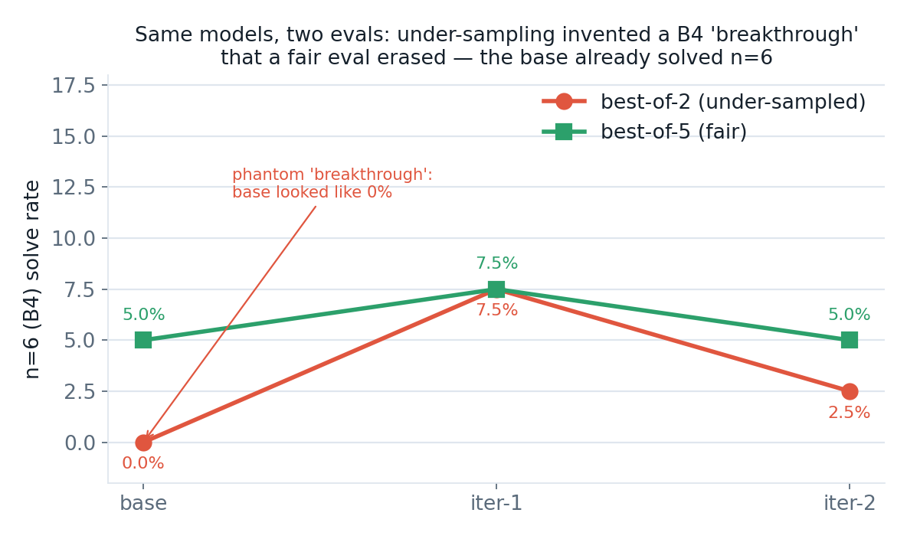

# Teaching a Small Model to Drive a Verifier-Backed Tool for Reversible-Circuit Synthesis: One Wall Removed, One Plateau Explained

> **TL;DR**
> - **The positive result (solid).** Asked to synthesize a reversible circuit in one shot, a 1.5B and a 7B model succeed at an *identical* 4.8%. The bottleneck is not capacity — it is *symbolic execution* (the model cannot track circuit state in its head). A state-externalizing **tool** removes that wall, and only *then* does scale matter: on the single 1.5B→8B step we observed, a trained 1.5B caps at n=4 while a trained 8B reaches n=5 (~40% at best-of-5, near-ceiling at n=6 ≈ 5%).
> - **The negative result (clean, and the main scientific content).** A self-harvest "flywheel" (expert iteration on the model's own verifier-confirmed solutions) produced **zero held-out improvement**: base, iter-1, and iter-2 differ by ≤1.2 points overall (58.1 / 56.9 / 58.1 at best-of-5), within the ~4–8 point per-band sampling error at n=40. SFT on a model's own correct outputs re-teaches what it already does; it cannot push the frontier of tasks it currently fails.
> - **The measurement lesson.** Two "wins" died to better evaluation: an 8-task eval inflated the base to 62.5% (real best-of-2: 51%), and a best-of-2 eval manufactured a "n=6 cracked 0→7.5%" breakthrough that best-of-5 erased (the base already solves n=6 at ~5%). Under-sampling at low solve rates *invents* progress.
> - **Artifacts.** Model: <https://huggingface.co/dennisonb/reversible-circuit-8b-tool> · Code, data factories, eval harness, full lab notebook: <https://github.com/dennisonbertram/reversible-circuit-llm>
> - This is a **negative result**, reported as one. We do not claim self-improvement.

## Abstract

We study whether a small open-weight language model can learn to synthesize reversible (quantum-classical) circuits, and whether it can *improve itself* at the task. As a faithful, cheap stand-in for the [ECDSA.fail](https://ecdsa.fail) secp256k1 point-addition challenge, we use a GF(2)-linear-map synthesis proxy graded by register width (n=3…6) and scored by a simulator that agreed with the Rust reference on every case of an 800-case test battery (800/800). We report three findings. First, without a tool the task is a wall that scale does not climb: a 1.5B and a 7B model one-shot-synthesize at an identical 4.8%, identifying the bottleneck as symbolic execution rather than capacity. Second, a state-externalizing tool removes that wall, and with the tool scale becomes decisive — on the single 1.5B→8B step we ran, a trained 1.5B caps at n=4 while a trained 8B reaches n=5. Third, and centrally, a self-harvest expert-iteration "flywheel" produced **no held-out improvement** (base, iter-1, and iter-2 differ by ≤1.2 points overall, ~58% at best-of-5); we explain the plateau mechanistically. Along the way two phantom positive results were created and then destroyed by adequately-sampled evaluation, which we treat as the most transferable lesson of the project. We release the 8B base model (the strongest checkpoint in the study), the code, and the complete lab notebook.

The three flywheel checkpoints are named consistently below: **base → iter-1 → iter-2**, where iter-2 (file label `fly8b_iter1`) was seeded from iter-1. The chain is therefore two sequential self-harvest steps, not two independent runs.

---

## 1. Problem and motivation

The [ECDSA.fail](https://ecdsa.fail) challenge asks for a reversible circuit that computes secp256k1 point addition at minimal cost (roughly, average Toffoli count × peak qubit count). This is a real, open optimization problem: there is no efficient classical method that yields the optimum, and each candidate is expensive to evaluate. We wanted to know whether a *small, open* model could learn this kind of synthesis as a transferable skill, and — more ambitiously — whether it could bootstrap its own improvement.

Training directly on the 256-bit frontier is infeasible: each evaluation is seconds of Rust simulation and the search space is astronomical. So we built a **proxy task** designed to preserve the structure of the real problem while being cheap enough to iterate on:

- **Real / verified.** Every candidate is checked by a bit-packed classical-reversible simulator. We confirmed this simulator (`proxy/proxy_env.py`) agreed with the Rust reference on **800/800** cases of a test battery — 400 basic plus 400 broad cases spanning the gate families and register widths used in the proxy (`proxy/test_equivalence.py`). Within that battery the grader is not a weak proxy of correctness; it *is* correctness. (800 agreements do not prove bit-identity in general, but cover the families and widths the experiments actually exercise.)
- **Gradeable.** Difficulty is register width n, in four bands: **B1 (n=3), B2 (n=4), B3 (n=5), B4 (n=6)**.
- **Cheap.** Microseconds per check, enabling large harvests and adequately-sampled evals.
- **Honestly hard.** The model must emit a gate sequence (`CX`, `CCX`/Toffoli, `SWAP`) that transforms the identity into a target GF(2) linear map, in place.

We focus on the `gf2_linear` family: given an invertible n×n GF(2) matrix, synthesize a reversible circuit that applies it. This family is *classically* solvable by Gaussian elimination — which is precisely how we generate **optimal expert demonstrations** (`proxy/synth.py`). The goal is not to beat Gaussian elimination; it is to test whether a small model can *learn tool-driven synthesis* and *self-improve* at it, as a method that might later transfer to problems where no closed-form expert exists.

We note up front the gap this proxy does *not* close: the n≤6 GF(2) family is a long way from a 256-bit non-linear point-addition circuit. Whether anything here transfers to the real frontier is entirely unexplored (§8, §9).

---

## 2. The symbolic-execution wall (1.5B == 7B == 4.8%)

Our first experiment was the obvious one: ask the model to emit the whole circuit in one shot (an `OP-STREAM` of gates), then verify it.

| Model | One-shot synthesis (held-out) |
|------|------|
| Qwen2.5-Coder-1.5B | 4.8% |
| Qwen2.5-Coder-7B | 4.8% |

The two rates are **identical**. Scaling the model roughly 5× did *nothing*. This is the fingerprint of a bottleneck that is not capacity: the model cannot mentally simulate the running circuit state across many gates, so it cannot tell whether its partial sequence is on track. It is synthesizing blind.


The lesson, paid for before we wrote any training code: *diagnose which wall you are hitting before reaching for a bigger model.* Here, more parameters were worthless because the limiting skill — symbolic execution of a growing circuit — is not what scale improves.

---

## 3. The tool intervention, and the point at which scale starts to matter

We built **`ToolEnv`** (`proxy/tooluse.py`): a stateful environment the model drives one gate per turn. After each gate, the tool re-renders the **current state versus the target**. For `gf2_linear`, it shows the *residual rows*, for example:

```
current y0 = x0 | target y0 = x0^x2^x4   <-- WRONG
```

The model no longer has to simulate in its head; it reacts to an externalized, always-correct view of what is still wrong. This mirrors how a human row-reduces while looking at the board.

Two immediate sub-findings shaped everything after:

- **Zero-shot tool use thrashes.** Untrained models emit ill-formed ops, undo their own progress, and loop. Having the state is not enough — the model must know what to *do* with it. (Consistent with our earlier finding that state-externalization alone does not beat the reasoning ceiling; the model must be *trained* to plan in the tool.)
- **The bottleneck moved, from state-tracking to sequential planning.** The tool is necessary but not sufficient.

We then built data factories for tool-driven traces (`proxy/tooltrace_gen.py`): expert demonstrations of the turn-by-turn play (one canonical op per turn), framed identically to how the model is evaluated (train == eval). One subtlety cost us real diversity early: omitting the truth table from prompts made targets underspecified and capped distinct tasks at ~2,300; including it unlocked 31,718 distinct tasks (a 14× increase).

**With the tool, scale does what it refused to do without it.** Training models on the tool-driven traces and evaluating them *driving the tool* on held-out tasks:

| Model (trained, tool-driven) | Top solvable band |
|------|------|
| 1.5B | B2 (n=4) — caps here; **0% at B3 even when trained on B3 data** |
| 8B | B3 (n=5) — solvable, materially above zero |

The 1.5B's failure at n=5 is a genuine **capacity ceiling**, not a data problem: it stays at 0% on B3 even when trained directly on B3. The same two models that were *identical* without the tool are a full band apart with it. Tooling converted a capacity-insensitive task into a capacity-sensitive one. On the single 1.5B→8B step we observed — one data point, not a trend — each ~5× of parameters bought roughly one more bit of width.

This also tells us *which* base to use for self-improvement. The small-n space saturates: there are only ~168 invertible 3×3 GF(2) matrices total, so the expert set already nearly exhausts B1/B2. New coverage can only come at n≥5 (n=5 ≈ 10M matrices) — exactly where only the 8B can play. The 1.5B is therefore the wrong base for a flywheel; the 8B is the real attempt.

---

## 4. The self-harvest flywheel (method)

The flywheel is expert iteration / STaR-flavored self-training, run inside the tool:

1. **Harvest.** Drive the latest model over fresh training tasks (best-of-N sampling). Keep **every verifier-confirmed solution** as new training data, in the exact eval framing, retaining the cheapest play per task.
2. **Combine.** Dedup expert + harvested solutions per task into a cumulative replay buffer.
3. **Retrain → merge → eval.** Run fresh LoRA SFT on the cumulative set; score against a fixed held-out set.

The intended mechanism: the model's own successes become the next round's curriculum, and improvement compounds.

Two engineering fixes made iteration affordable, and one bookkeeping bug nearly poisoned the experiment:

- **Drop-on-no-progress.** Early harvests took ~3.3 hours because *stuck rollouts ran out the full turn budget* (84 turns × 5 restarts) on tasks the model could not solve. We track the residual mismatch count and abandon a rollout if it has not improved for ~10 turns. Because the render is **Markov** (the current residual fully specifies the remaining problem), we also cut the live context window from 22 turns to 8 — ~2.5× less prefill at no loss. Harvest time dropped from ~3.3h toward minutes-to-~1h.
- **The cap was subtracting expert data (a bug, since fixed).** We capped the replay buffer at 1000 traces/band to bound SFT time — but the base trained on 1200 demos/band, so the "cumulative" set initially had *fewer* hard-band demos than the base. The cap was net-*subtracting* signal on exactly the bands that matter. We raised the cap to 1500 and made `combine.py` always preserve harvested traces (they are scarcer than synth-optimal expert demos and a naive cheapest-N cap silently discarded them). This bug existed but, per §6, is not what caused the plateau — the plateau is intrinsic to self-harvest.

**The 8B base.** We trained Qwen3-8B on a B4-rich compact trace set (1200 optimal demos/band for the hard bands). Straight from imitation it is already strong on n≤4 and has a hole at n=6:

| Eval | B1 | B2 | B3 | B4 | Overall |
|------|----|----|----|----|---------|
| 8-task/band (noisy) | 100% | 87.5% | 62.5% | 0% | 62.5% |
| **40-task/band (clean, best-of-2, temp 0.4)** | **95%** | **85%** | **25%** | **0%** | **51.2%** |

This is the checkpoint we iterate from, and (spoiler) the strongest one we produced.

---

## 5. Results — the negative result

We evaluated the base and the two flywheel iterations (iter-1 and iter-2, where iter-2 = `fly8b_iter1` seeded from iter-1) on a fixed held-out set of 40 tasks/band, same seeds, identical protocol, scored on every checkpoint. We report two protocols, and the difference between them is itself a result. **The two protocols differ in both the number of samples (k) and the sampling temperature** — best-of-2 at temp 0.4, best-of-5 at temp 0.7 — so framing the gap as "k alone" below is a simplification; both knobs move.

### 5.1 Best-of-2 (the protocol that misled us)

| Stage | B1 | B2 | B3 | B4 | Overall | Note |
|------|----|----|----|----|---------|------|
| 8B base | 95% | 85% | 25% | **0%** | 51.2% | B4 0/40 — but this is best-of-2 *under-sampling* |
| 8B iter-1 | 97.5% | 82.5% | 20% | **7.5%** | 51.9% | "B4 cracked" — artifact |
| 8B iter-2 | 97.5% | 85% | 22.5% | **2.5%** | 51.9% | flat |

Read naively, this table says the flywheel cracked n=6: B4 went 0% → 7.5%, with overall flat because B1/B2 are saturated and B3 is within noise. That is the story we believed and wrote up. It is wrong.

### 5.2 Best-of-5 (the fair eval, and the verdict)

We re-ran all three checkpoints at best-of-5 (temp 0.7), matching how the model is actually used (multiple attempts, verifier picks the winner). The numbers below are taken directly from `flywheel/bo5_results.jsonl`.

| Stage | B1 | B2 | B3 | B4 | Overall |
|------|----|----|----|----|---------|
| 8B base | 95% | 92.5% | 40% | 5.0% | **58.1%** |
| 8B iter-1 | 100% | 82.5% | 37.5% | 7.5% | 56.9% |
| 8B iter-2 | 100% | 92.5% | 35% | 5.0% | **58.1%** |

**The three checkpoints differ by ≤1.2 points overall (58.1 / 56.9 / 58.1), well within the ~4–8 point per-band sampling error at n=40. The flywheel produced no detectable held-out improvement.** Our target was ≥65% overall with B4 > 0; the model sits at ~58% best-of-5 and does not move with iteration.


Two corrections fall out, and both matter:

1. **"B4 cracked 0 → 7.5%" was a measurement artifact.** At best-of-5 the *base already solves B4 at 5%* (2/40). It was never truly 0 — with only 2 attempts it got an unlucky 0/40 draw. The flywheel did not crack n=6; the base was already there. The companion "5 self-solutions beat 1200 expert demos on n=6" story dissolves entirely under the fair eval.
2. **The harvest gains did not generalize.** On *training* tasks the harvest yield rose between the two measured rounds (B3 35.8% → 44.2% best-of-5, i.e. 43/120 → 53/120; B4 harvest doubled from 4.2% to 8.3%, 5/120 → 10/120). But held-out best-of-5 B3 is, if anything, slightly lower (40% → 37.5% → 35%, i.e. 16/40 → 15/40 → 14/40). That held-out drift is one sample per step and well inside binomial noise (at p≈0.4, n=40, SE ≈ 7.7 points), so we decline to read a direction into it. What it does *not* show is held-out improvement: the model got better at producing solutions on the *training distribution* without that translating to the held-out set.




A separate **B4 ceiling probe** — a B4-only harvest **on training tasks (not held-out)** from the base, over 400 fresh tasks at best-of-6 — yielded ~3.5% (14 solves out of 400). So n=6 is genuinely near the 8B's ceiling even on the training distribution, and self-harvest is a slow lever there: too slow, per the held-out eval, to shift capability at all.

---

## 6. Why it plateaus (mechanism)

The plateau is not a bug; it is what self-harvest expert iteration *does* on a task already saturated at the model's ceiling. STaR-style self-training adds signal only when the harvested solutions teach the model to solve things it *couldn't* before. Here that condition fails on every band:

- **The harvest is dominated by tasks the model already solves.** B2 is saturated; B3 is solved often enough that most harvested traces are redundant with what the base already knows. Training on them re-teaches the existing distribution and adds no new information.
- **The frontier solves are too few and too noisy.** The rare B4 (n=6) successes (~2–8% on training-task harvests) are not enough to shift the boundary, and they are themselves at the edge of sampling noise.
- **The base has already extracted what imitation can give.** It was trained on 1200 *optimal* expert demonstrations per band and sits at the 8B's capability ceiling (~58% best-of-5) for this task. Iterating on its own outputs cannot exceed that ceiling; it can only re-learn the same distribution.

Put plainly: **SFT on a model's own verified solutions cannot exceed the model's own solution distribution.** To push the frontier — the tasks it currently fails — you need a method that optimizes for currently-failed tasks, not one that imitates current successes.

This is also why a parallel 1.5B "does the loop even run?" validation run should *not* be read as evidence of effectiveness. It ran end-to-end across three iterations (proving the plumbing works), but only at **6 tasks/band**. Its overall sequence is non-monotone — 0.25 → 0.375 → 0.292 → 0.417 — going up, then down, then up; and the only band that "rose," B3, moved 0/6 → 1/6 → 1/6. That is exactly the small-sample wobble §7 warns against. The durable takeaway from this run is narrow: the loop runs without breaking.

---

## 7. The measurement-discipline lesson (two phantoms)

The single most useful output of this project is a discipline, not a model: **most of our apparent progress was measurement noise.** Two separate "wins" died the moment we measured them properly.

**Phantom 1 — the 62.5% base.** An 8-task/band eval read the base at 62.5% overall, driven by a lucky 5/8 draw on B3 that implied a 62.5% B3 rate. The real best-of-2 figure is 51.2% overall with B3 ≈ 25%. At 8 samples/band a single band swings ±25 points on luck. This phantom also caused a *wrong decision*: a flywheel iteration's 8-task eval looked like a B3 regression (down from the inflated 62.5%), so we killed the run early — when in fact iter-1's B3 *matched* the true base.

**Phantom 2 — the B4 "breakthrough."** As shown in §5, a best-of-2 eval manufactured a 0% → 7.5% B4 gain that best-of-5 erased; the base already solved n=6 at 5%. Under-sampling at low solve rates does not merely add variance — it systematically *invents* progress, because a base with a true 5% rate frequently draws 0/40 at 2 attempts, making any later non-zero draw look like a new capability.

The fix was cheap and high-leverage: a **fixed, adequately-sampled, identical-protocol held-out set** (40 tasks/band, same seeds) scored on the base and every iteration, reporting best-of-k and anchoring every comparison against the base at the *same* k *and the same temperature*. That instrument is what separated the one real finding (the tool removes the wall; scale then matters) from the two phantoms. The transferable rule: at low solve rates, report best-of-k, hold both k and temperature fixed, and never compare across different protocols.

---

## 8. Limitations

- **Negative result, narrow scope.** "Self-harvest does not improve the model" is established for *this* task, *this* base (Qwen3-8B), and *this* SFT recipe. It is not a claim about expert iteration in general.
- **Proxy ≠ target.** The GF(2)-linear family at n≤6 is far from a 256-bit non-linear point-addition circuit. We never attempted the real ECDSA.fail frontier; transfer is entirely unexplored.
- **The expert is a closed-form algorithm.** Because Gaussian elimination supplies optimal demonstrations, the base is already near-ceiling from imitation — which is part of *why* self-harvest has no room to add. On a task with no efficient expert, the dynamics could differ.
- **Ceiling vs. method.** We cannot fully separate "self-harvest is the wrong method" from "the 8B is simply at its capacity ceiling." Both are consistent with the data; a larger base would help disentangle them.
- **One scale step.** The "scale buys width" observation rests on a single 1.5B→8B comparison at one task family — one data point, not a trend.
- **Two iterations.** We ran two flywheel iterations before the fair eval confirmed the plateau and we stopped (no iter-3). We do not claim what an asymptotically long loop would do — only that there is no signal of upward motion in the first two, and a mechanism that predicts none.
- **Modest absolute scale.** Larger sweeps (more iterations, larger bases, RL) were out of scope.

---

## 9. Future work

The negative result is specific — SFT on self-solves cannot exceed the model's own distribution — which points directly at the levers it does *not* cover:

1. **RL with the verifier reward (GRPO).** The natural fix: a policy-gradient method can reward the model for *solving tasks it currently fails*, which is exactly what SFT-on-self-solves cannot do. Earlier GRPO attempts collapsed via format-reward hacking; the fix is a strictly validity-gated, verifier-grounded reward (reward only on a *verified-correct* circuit, shaped by cost). Driving the **tool** under GRPO, with per-gate credit assignment against the residual, is the most promising untried configuration.
2. **A frontier curriculum.** Grade n=5/n=6 tasks by intrinsic difficulty (off-diagonal pivots / minimal solution length) and train easy→hard, so the model climbs the frontier rather than being handed only the hardest instances. Composes with either SFT or RL.
3. **A larger base.** Since the one robust positive is "with the tool, scale matters," the cleanest way up may simply be a bigger base (14B/30B) — and that would also disentangle "wrong method" from "model ceiling."
4. **Transfer.** The unaddressed question: does tool-driven synthesis learned on the n≤6 proxy carry to the real 256-bit secp256k1 frontier at all?

---

## 10. Artifacts and reproducibility

- **Model (the SFT base — the strongest checkpoint in the study):** <https://huggingface.co/dennisonb/reversible-circuit-8b-tool>
- **Code, data factories, eval harness, and the complete lab notebook:** <https://github.com/dennisonbertram/reversible-circuit-llm>
- **Verifier.** `proxy/proxy_env.py` agreed with the Rust reference simulator on **800/800** cases of the equivalence battery (`proxy/test_equivalence.py`: 400 basic + 400 broad cases across the gate families and widths the proxy uses); within that battery, correctness in this paper means a circuit the reference accepts, not a learned proxy of correctness.
- **Eval data.** Best-of-2 results (temp 0.4): `flywheel/clean_eval_results.jsonl`. Best-of-5 results (temp 0.7): `flywheel/bo5_results.jsonl`. Both are 40 tasks/band, same fixed held-out seeds across base / iter-1 / iter-2.
- **Method.** Base: `Qwen/Qwen3-8B` (Apache-2.0). LoRA SFT via Unsloth/TRL on Modal. Tool environment: `proxy/tooluse.py`; expert demos: `proxy/synth.py`; trace factory: `proxy/tooltrace_gen.py`; flywheel harvest/combine: `flywheel/`, `train/flywheel_harvest.py`.

We ship the **base** because the flywheel iterations did not beat it.

---

## References

- E. Zelikman, Y. Wu, J. Mu, N. D. Goodman. *STaR: Bootstrapping Reasoning With Reasoning.* NeurIPS, 2022. (Self-training on a model's own verifier-confirmed solutions — the family of method our flywheel instantiates.)
- A. Anthony, Z. Tian, D. Barber. *Thinking Fast and Slow with Deep Learning and Tree Search.* NeurIPS, 2017. (Expert iteration — the alternate name for the bootstrap-on-own-solutions loop.)
- Z. Shao, P. Wang, Q. Zhu, et al. *DeepSeekMath: Pushing the Limits of Mathematical Reasoning in Open Language Models.* 2024. (Introduces GRPO, the verifier-reward policy-gradient method proposed in §9.)
- The ECDSA.fail reversible-circuit challenge. <https://ecdsa.fail>

*(We deliberately omit citations we could not attribute with confidence — including the specific provenance of "RLVR" / verifier-reward RL and best-of-n sampling as named techniques — rather than guess. Those methods are used here as described in the text without attribution.)*
